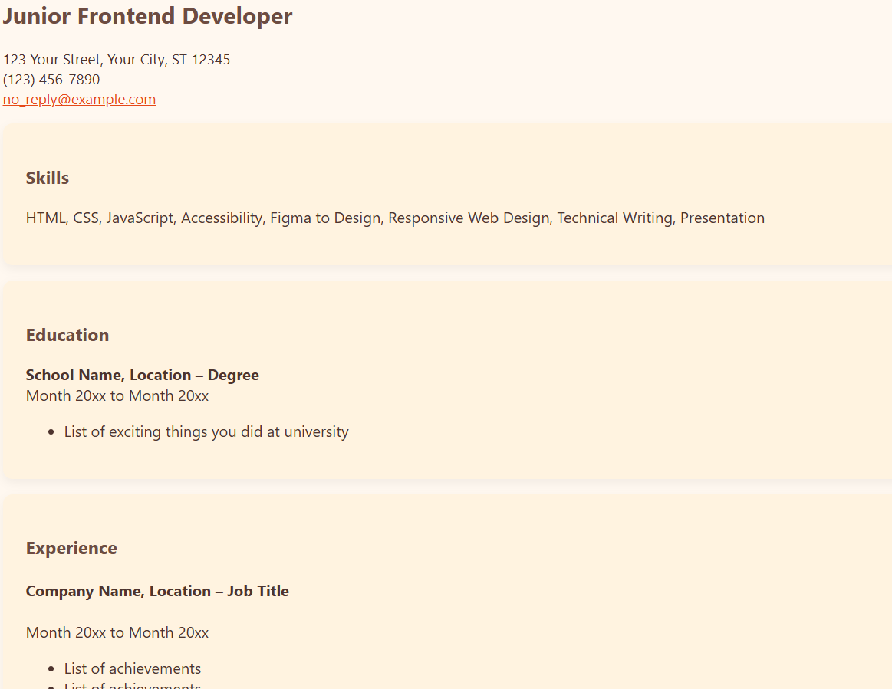
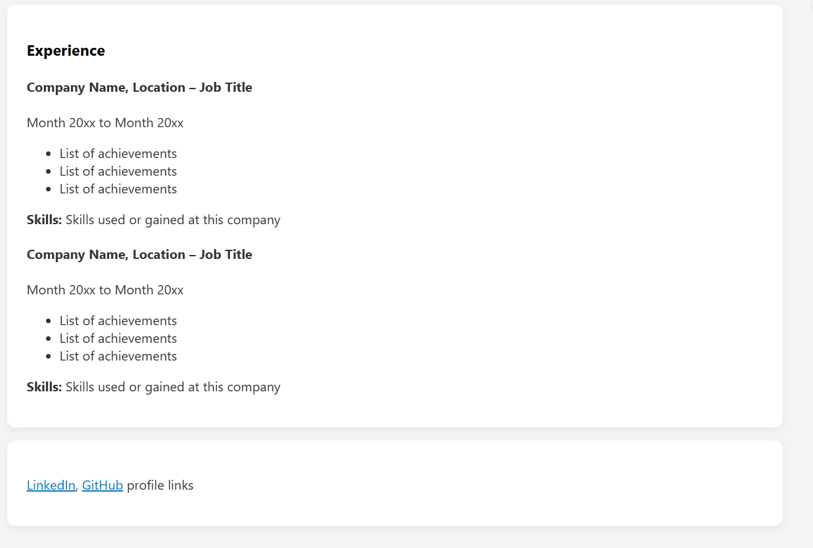

# HTML CV Template

A simple, elegant, and mobile-friendly HTML CV/resume template designed for developers and professionals. Customize it with your real resume data and host it instantly using GitHub Pages – no backend, no frameworks, just clean HTML & CSS.

## Features

- ✅ Easy to edit
- ✅ Fully responsive
- ✅ Includes favicon support
- ✅ Perfect for job applications and portfolios
- ✅ No frameworks or backend required
- ✅ Supports multiple themes (Light, Dark, Blue, Warm)
- ✅ Clean and simple design

## Customization

1. **Edit the HTML file**: Open `index.html` in your text editor.
    - Replace placeholder content (name, job title, skills, education, etc.) with your own information.
2. **Change the favicon**: Upload your own favicon images (16x16 and 32x32) in `.png` format and update the `href` links in the `<head>` section.
3. **Modify styles**: Feel free to update the CSS for colors, fonts, and layout to match your personal style.

## Usage

1. **Clone the repository**:  
    To get started, clone this repository to your local machine:

    ```bash
    git clone https://github.com/SoumayLightRay/HTML-CV-Project.git
    ```

2. **Navigate into your project directory**:

    ```bash
    cd HTML-CV-Project
    ```

3. **Open the `index.html` file** in your web browser to view the site locally.

    ```bash
    open index.html  # MacOS, or double-click index.html for other systems
    ```

4. **Deploy on GitHub Pages**:
    - Push your changes to GitHub.
    - Go to your repository’s settings.
    - Scroll down to **GitHub Pages** and select the branch you want to deploy (usually `main`).
    - Your site will be live at `https://username.github.io/HTML-CV-Project`.

## Screenshots

Here's a preview of the template:

  <!-- You can replace this with your actual screenshot file -->


## License

This project is licensed under the MIT License .


